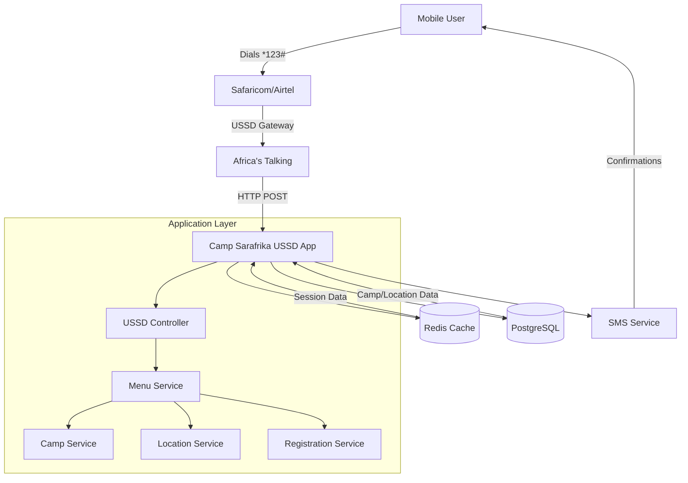

# System Overview

## Introduction

Camp Sarafrika USSD is a mobile-first camp registration system designed for the Kenyan market. It leverages USSD (Unstructured Supplementary Service Data) technology to provide accessible camp registration via basic mobile phones, ensuring broad reach across all mobile device types.

## Architecture Overview



## System Components

### 1. USSD Interface Layer
- **Entry Point**: Dial code `*123#`
- **Session Management**: Redis-based state persistence
- **Response Format**: CON (continue) / END (terminate) prefixed messages
- **Navigation**: Hierarchical menu system with back navigation

### 2. Core Services

#### MenuService
- Orchestrates USSD flow and state transitions
- Handles user input validation and routing
- Manages pagination for large datasets
- Formats responses for USSD display constraints

#### CampService
- Manages camp data and categories
- Provides filtered camp listings
- Handles camp-location relationships

#### LocationService
- Manages location data and pricing
- Provides location-based fee calculations
- Supports location filtering and search

#### RegistrationService
- Handles participant registration process
- Generates unique reference codes
- Manages registration status lifecycle
- Integrates with payment and SMS systems

### 3. Data Layer

#### PostgreSQL Database
- **Normalized structure** with proper relationships
- **Flyway migrations** for version control
- **JSONB support** for flexible data storage
- **Audit trails** with BaseEntity tracking

#### Redis Cache
- **Session storage** for USSD state management
- **Fast retrieval** for user navigation history
- **Temporary data** for multi-step processes
- **TTL-based cleanup** for abandoned sessions

### 4. External Integrations

#### Africa's Talking API
- **USSD Gateway** for mobile network integration
- **SMS notifications** for confirmations
- **Delivery tracking** for message status
- **Webhook handling** for real-time updates

#### Mobile Networks
- **Safaricom** and **Airtel** integration
- **USSD shortcode** provisioning
- **Session timeout** handling
- **Network-specific** optimization

## Data Flow Overview

### 1. User Interaction Flow
```
Mobile User → Network → AT Gateway → USSD Controller → Menu Service → Response
```

### 2. Registration Flow
```
User Input → Validation → Camp Selection → Location Fee → Registration → SMS → Payment
```

### 3. Data Persistence Flow
```
User Session → Redis → Registration Data → PostgreSQL → SMS Confirmation
```

## Key Design Principles

### 1. Mobile-First Design
- **USSD constraints**: 160 character limit per message
- **Network latency**: Optimized for slow connections
- **Device compatibility**: Works on all mobile phones
- **Local language**: Kenyan English and Swahili support

### 2. Scalability
- **Stateless services** for horizontal scaling
- **Redis clustering** for session management
- **Database indexing** for performance
- **Async processing** for SMS and notifications

### 3. Data Normalization
- **Location-based pricing** separate from camps
- **Activity relationships** properly modeled
- **Audit trails** for all entities
- **Soft deletes** for data integrity

### 4. Reliability
- **Session recovery** after network interruptions
- **Graceful degradation** for service failures
- **Comprehensive logging** for debugging
- **Health checks** for monitoring

## User Journey

### Registration Process
1. **Discovery**: User dials `*123#`
2. **Category Selection**: Choose camp type (Sports, YMAC, Tech, etc.)
3. **Camp Type**: Select Half Day or Boot Camp
4. **Camp Selection**: Browse available camps with location and pricing
5. **Activity Selection**: Choose specific activities within camp
6. **Participant Details**: Enter name, age, contact information
7. **Guardian Details**: For minors (5-18 years)
8. **Confirmation**: Review and confirm registration
9. **Payment**: M-Pesa STK push integration
10. **Completion**: SMS confirmation with reference code

### Support Features
- **My Bookings**: View existing registrations
- **Help System**: Registration guide and payment info
- **Contact Support**: Direct contact information
- **Back Navigation**: Return to previous menu at any step

## Performance Characteristics

### Response Time Targets
- **USSD Response**: < 3 seconds
- **Database Queries**: < 500ms
- **SMS Delivery**: < 30 seconds
- **Session Recovery**: < 1 second

### Scalability Metrics
- **Concurrent Sessions**: 1000+ simultaneous users
- **Daily Registrations**: 5000+ per day
- **Peak Load**: 100 registrations/minute
- **Database Growth**: 10GB+ annually

## Security Considerations

### Data Protection
- **PII Encryption**: Phone numbers and personal data
- **Session Security**: Redis with authentication
- **API Security**: Rate limiting and validation
- **Audit Logging**: All user actions tracked

### Payment Security
- **M-Pesa Integration**: Secure payment gateway
- **Reference Codes**: Unique, non-sequential
- **Transaction Verification**: Payment status validation
- **Refund Support**: Cancellation and refund flow

---

**Next**: [Database Schema & Relationships](./02-DATABASE_SCHEMA.md)