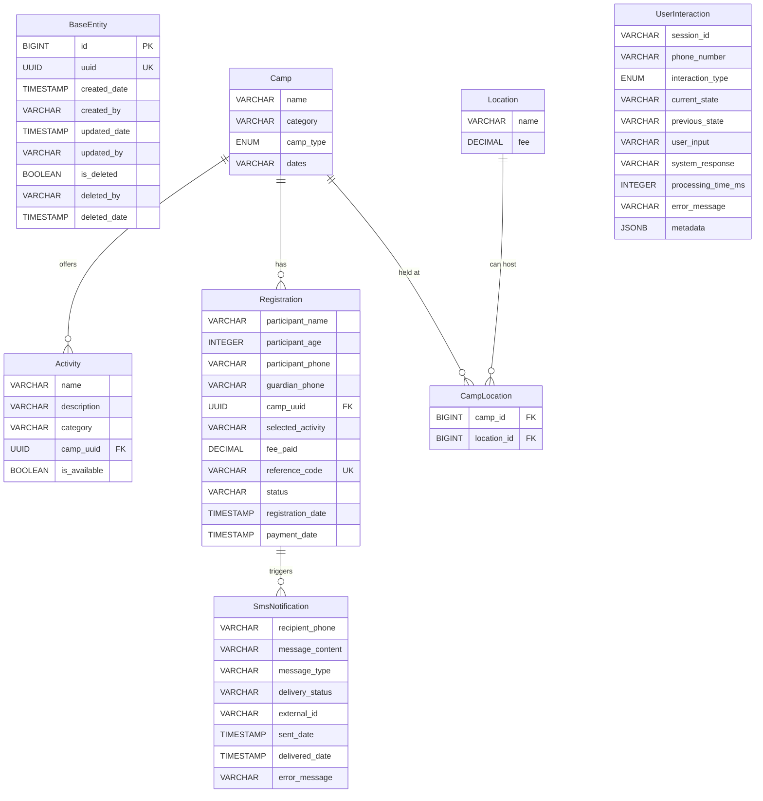

# Database Schema & Relationships

## Schema Overview

The Camp Sarafrika database follows a normalized approach with clear separation of concerns and proper relationships. All tables inherit from `BaseEntity` for consistent auditing and soft delete functionality.

## Entity Relationship Diagram



## Core Entities

### 1. BaseEntity (Abstract)
```sql
-- Inherited by all entities for consistent auditing
CREATE TABLE base_fields (
    id BIGSERIAL PRIMARY KEY,
    uuid UUID NOT NULL UNIQUE DEFAULT gen_random_uuid(),
    created_date TIMESTAMP DEFAULT CURRENT_TIMESTAMP,
    created_by VARCHAR(255),
    updated_date TIMESTAMP DEFAULT CURRENT_TIMESTAMP,
    updated_by VARCHAR(255),
    is_deleted BOOLEAN DEFAULT FALSE,
    deleted_by VARCHAR(255),
    deleted_date TIMESTAMP
);
```

**Purpose**: Provides consistent auditing and soft delete functionality across all entities.

### 2. Location Entity
```sql
CREATE TABLE locations (
    -- BaseEntity fields inherited
    name VARCHAR(255) NOT NULL,
    fee DECIMAL(10,2) NOT NULL
);
```

**Purpose**: Stores location information with associated pricing.

**Key Features**:
- Each location has its own fee structure
- Supports multiple camps per location
- Enables location-based pricing strategies

**Example Data**:
```sql
INSERT INTO locations (name, fee) VALUES
('Kiambu', 12500.00),
('Nairobi', 12500.00),
('Rongai', 12500.00),
('Naivasha', 15000.00),
('Mombasa', 18000.00);
```

### 3. Camp Entity
```sql
CREATE TABLE camps (
    -- BaseEntity fields inherited
    name VARCHAR(255) NOT NULL,
    category VARCHAR(100) NOT NULL,
    camp_type VARCHAR(50) NOT NULL, -- HALF_DAY, BOOT_CAMP
    dates VARCHAR(255) NOT NULL
);
```

**Purpose**: Represents camp programs available for registration.

**Relationships**:
- Many-to-Many with Locations (via `camp_locations`)
- One-to-Many with Activities
- One-to-Many with Registrations

**Categories**:
- Sports
- Young Musicians & Artists Camp (YMAC)
- Science & Tech
- Culture & Heritage
- Outdoor & Adventure

### 4. Activity Entity
```sql
CREATE TABLE activities (
    -- BaseEntity fields inherited
    name VARCHAR(255) NOT NULL,
    description TEXT,
    category VARCHAR(100),
    camp_uuid UUID NOT NULL,
    is_available BOOLEAN DEFAULT TRUE,
    
    FOREIGN KEY (camp_uuid) REFERENCES camps(uuid)
);
```

**Purpose**: Specific activities offered within camps.

**Example Activities** (from PDF specification):
```sql
INSERT INTO activities (name, category, camp_uuid) VALUES
('Know your Talent Beginners Program', 'Foundation', camp_uuid),
('Photography', 'Visual Arts', camp_uuid),
('Musical Theatre', 'Performance', camp_uuid),
('String Ensemble', 'Music', camp_uuid),
('Marching Band', 'Music', camp_uuid),
('Pop, Rock & RnB', 'Music', camp_uuid),
('Ballet', 'Dance', camp_uuid),
('Piano Ensemble', 'Music', camp_uuid),
('Guitar Ensemble', 'Music', camp_uuid),
('Jazz Band', 'Music', camp_uuid),
('Creative Writing', 'Literature', camp_uuid),
('Visual Arts', 'Arts', camp_uuid),
('Deejaying', 'Music Technology', camp_uuid);
```

### 5. Registration Entity
```sql
CREATE TABLE registrations (
    -- BaseEntity fields inherited
    participant_name VARCHAR(255) NOT NULL,
    participant_age INTEGER NOT NULL,
    participant_phone VARCHAR(20) NOT NULL,
    guardian_phone VARCHAR(20),
    camp_uuid UUID NOT NULL,
    selected_activity VARCHAR(255),
    fee_paid DECIMAL(10,2),
    reference_code VARCHAR(20) UNIQUE NOT NULL,
    status VARCHAR(50) DEFAULT 'PENDING',
    registration_date TIMESTAMP DEFAULT CURRENT_TIMESTAMP,
    payment_date TIMESTAMP,
    
    FOREIGN KEY (camp_uuid) REFERENCES camps(uuid)
);
```

**Purpose**: Stores participant registration information.

**Status Flow**:
- `PENDING` → `PAID` → `CONFIRMED` → `ATTENDED`
- `CANCELLED` (at any stage)

**Reference Code Format**: `CS-{6 chars}` (e.g., `CS-A4T9B1`)

### 6. Camp-Location Junction Table
```sql
CREATE TABLE camp_locations (
    camp_id BIGINT NOT NULL,
    location_id BIGINT NOT NULL,
    PRIMARY KEY (camp_id, location_id),
    FOREIGN KEY (camp_id) REFERENCES camps(id),
    FOREIGN KEY (location_id) REFERENCES locations(id)
);
```

**Purpose**: Many-to-many relationship between camps and locations.

## Supporting Entities

### 7. SMS Notification Entity
```sql
CREATE TABLE sms_notifications (
    -- BaseEntity fields inherited
    recipient_phone VARCHAR(20) NOT NULL,
    message_content TEXT NOT NULL,
    message_type VARCHAR(50) NOT NULL,
    delivery_status VARCHAR(50) DEFAULT 'PENDING',
    external_id VARCHAR(100),
    sent_date TIMESTAMP,
    delivered_date TIMESTAMP,
    error_message TEXT
);
```

**Message Types**:
- `REGISTRATION_CONFIRMATION`
- `GUARDIAN_NOTIFICATION`
- `PAYMENT_CONFIRMATION`
- `CAMP_REMINDER`
- `CANCELLATION_NOTICE`

### 8. User Interaction Tracking
```sql
CREATE TABLE user_interactions (
    -- BaseEntity fields inherited
    session_id VARCHAR(255) NOT NULL,
    phone_number VARCHAR(20) NOT NULL,
    interaction_type VARCHAR(50) NOT NULL,
    current_state VARCHAR(100),
    previous_state VARCHAR(100),
    user_input TEXT,
    system_response TEXT,
    processing_time_ms INTEGER,
    error_message TEXT,
    metadata JSONB
);
```

**Purpose**: Comprehensive tracking of user interactions for analytics and debugging.

## Database Indexes

### Performance Optimization
```sql
-- Core lookups
CREATE INDEX idx_camps_category ON camps(category);
CREATE INDEX idx_camps_uuid ON camps(uuid);
CREATE INDEX idx_locations_name ON locations(name);

-- Registration queries
CREATE INDEX idx_registrations_phone ON registrations(participant_phone);
CREATE INDEX idx_registrations_reference ON registrations(reference_code);
CREATE INDEX idx_registrations_status ON registrations(status);

-- Activity lookups
CREATE INDEX idx_activities_camp_uuid ON activities(camp_uuid);
CREATE INDEX idx_activities_category ON activities(category);

-- Junction table optimization
CREATE INDEX idx_camp_locations_camp_id ON camp_locations(camp_id);
CREATE INDEX idx_camp_locations_location_id ON camp_locations(location_id);

-- Tracking and analytics
CREATE INDEX idx_user_interactions_session ON user_interactions(session_id);
CREATE INDEX idx_user_interactions_phone ON user_interactions(phone_number);
CREATE INDEX idx_user_interactions_created ON user_interactions(created_date);

-- SMS tracking
CREATE INDEX idx_sms_notifications_phone ON sms_notifications(recipient_phone);
CREATE INDEX idx_sms_notifications_status ON sms_notifications(delivery_status);
```

## Data Integrity Constraints

### Business Rules
```sql
-- Age validation for participants
ALTER TABLE registrations ADD CONSTRAINT chk_participant_age 
CHECK (participant_age >= 5 AND participant_age <= 18);

-- Phone number format validation (Kenyan numbers)
ALTER TABLE registrations ADD CONSTRAINT chk_participant_phone 
CHECK (participant_phone ~ '^(\+254|254|0)[17][0-9]{8}$');

-- Fee validation
ALTER TABLE locations ADD CONSTRAINT chk_location_fee 
CHECK (fee > 0);

-- Reference code uniqueness
ALTER TABLE registrations ADD CONSTRAINT uk_reference_code 
UNIQUE (reference_code);
```

## Migration Strategy

### Flyway Versioning
- `V202509081541__create_camps_table.sql`
- `V202509081542__create_registrations_table.sql`
- `V202509092301__create_activities_table.sql`
- `V202509100300__create_locations_table_and_normalize_camps.sql`
- `V202509100301__remove_activities_jsonb_from_camps.sql`

### Data Seeding
Each migration includes sample data that aligns with the USSD flow requirements and PDF specifications.

## Query Patterns

### Common Queries

#### Get camps by category with location pricing
```sql
SELECT c.name, c.dates, l.name as location, l.fee
FROM camps c
JOIN camp_locations cl ON c.id = cl.camp_id
JOIN locations l ON cl.location_id = l.id
WHERE c.category = 'Young Musicians & Artists Camp (YMAC)'
AND c.is_deleted = FALSE;
```

#### Get activities for a specific camp
```sql
SELECT a.name, a.description, a.category
FROM activities a
WHERE a.camp_uuid = ? 
AND a.is_deleted = FALSE 
AND a.is_available = TRUE;
```

#### Get registration summary with camp and location details
```sql
SELECT r.reference_code, r.participant_name, 
       c.name as camp_name, l.name as location, l.fee
FROM registrations r
JOIN camps c ON r.camp_uuid = c.uuid
JOIN camp_locations cl ON c.id = cl.camp_id
JOIN locations l ON cl.location_id = l.id
WHERE r.participant_phone = ?
AND r.is_deleted = FALSE;
```

---

**Next**: [Data Population Guide](./03-DATA_POPULATION.md)