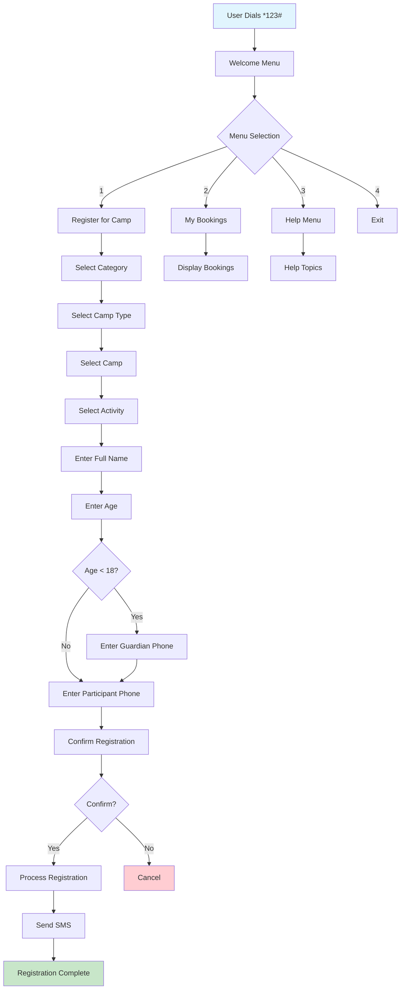
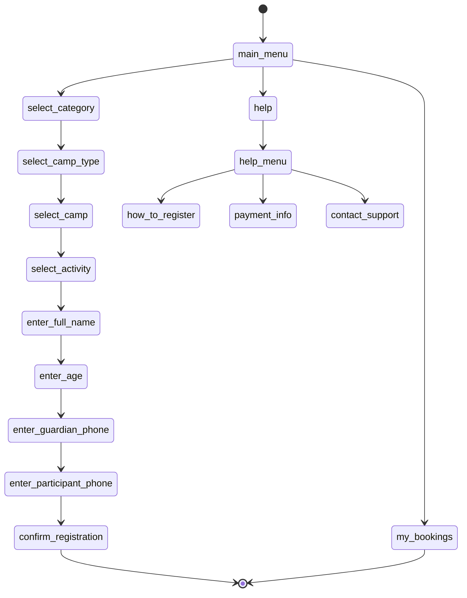

# USSD Flow Documentation

## Overview

This document provides a comprehensive walkthrough of the Camp Sarafrika USSD flow, from initial dial to registration completion. The flow follows the specification outlined in the PDF document with enhanced error handling and user experience optimizations.

## USSD Flow Diagram



## Detailed Flow Steps

### Entry Point

#### Initial Dial: *123#
```
CON Welcome to Camp Sarafrika!

1. Register for a Camp
2. My Bookings
3. Help
4. Exit
```

**System Process:**
- Creates new USSD session in Redis
- Initializes user session with phone number
- Sets initial state to `main_menu`
- Tracks interaction for analytics

### 1. Registration Flow

#### Step 1: Category Selection
```
CON Select a camp category:

1. Sports
2. Young Musicians & Artists Camp (YMAC)
3. Science & Tech
4. Culture & Heritage
5. Outdoor & Adventure

0. Back
```

**Backend Query:**
```sql
SELECT DISTINCT category FROM camps 
WHERE is_deleted = FALSE 
ORDER BY category;
```

**Session Data:**
- State: `select_category`
- Available options stored in session

#### Step 2: Camp Type Selection
```
CON Camp Type:

1. Half Day: 9:00am - 13:00pm
2. Boot Camp: Boarding

0. Back
```

**System Process:**
- Stores selected category in session
- Transitions to `select_camp_type` state
- Validates user input (1-2 only)

#### Step 3: Camp Selection with Pagination
```
CON Young Musicians & Artists C... Camps:

1. Consolata School - Kiambu, KSH 12,500
2. Creative Integrated School - Nairobi, KSH 12,500
3. Olerai Rongai School - Rongai, KSH 12,500

99. More >>
0. Back
```

**Backend Query:**
```sql
SELECT c.name, l.name as location, l.fee, c.dates
FROM camps c
JOIN camp_locations cl ON c.id = cl.camp_id
JOIN locations l ON cl.location_id = l.id
WHERE c.category = ? AND c.camp_type = ?
AND c.is_deleted = FALSE
LIMIT 3 OFFSET ?;
```

**Features:**
- **Pagination**: 3 camps per page with "More >>" option
- **Location-based Pricing**: Fee comes from location entity
- **Smart Truncation**: Long names abbreviated for USSD constraints
- **Clean Names**: Removes redundant prefixes (e.g., "YMAC")

#### Step 4: Activity Selection
```
CON Select Activity:

1. Know your Talent Beginners Program
2. Photography
3. Musical Theatre

99. More >>
0. Back
```

**Backend Query:**
```sql
SELECT name, description FROM activities 
WHERE camp_uuid = ? 
AND is_deleted = FALSE 
AND is_available = TRUE
ORDER BY category, name;
```

**Fallback**: If no activities available, proceed directly to participant details.

#### Step 5: Participant Details Collection

##### Full Name Input
```
CON Enter participant's full name:

0. Back
```

**Validation:**
- Minimum 2 characters
- No special character restrictions
- Stored as `participantName` in session

##### Age Input
```
CON Enter participant's age:

0. Back
```

**Validation:**
- Must be integer between 5-18
- Ages outside range show error message
- All participants require guardian details (5-18 age range)

##### Guardian Phone Input
```
CON Enter guardian's phone number:

0. Back
```

**Validation Pattern:**
```regex
^(\+254|254|0)[17][0-9]{8}$
```

**Accepted Formats:**
- `+254712345678`
- `254712345678`
- `0712345678`

##### Participant Phone Input
```
CON Enter participant's phone number:

0. Back
```

**Same validation** as guardian phone.

#### Step 6: Registration Confirmation
```
CON Registration Summary:

Camp: YMAC Consolata School
Location: Kiambu
Dates: 17th-29th Nov
Participant: John Doe
Age: 16
Fee: KSH 12,500

1. Confirm & Pay
2. Cancel

0. Back
```

**Data Sources:**
- Camp details from database
- Location and fee from location entity
- Participant data from session
- Dynamic fee calculation based on selected location

#### Step 7: Registration Processing

##### Success Response
```
END Registration successful!

Reference: CS-A4T9B1

Please complete payment via M-Pesa.
You will receive SMS confirmations.

Thank you for choosing Camp Sarafrika!
```

**Backend Process:**
1. Create registration record
2. Generate unique reference code (format: `CS-{6chars}`)
3. Send SMS to participant
4. Send SMS to guardian (if different number)
5. Return success message

##### SMS Notifications

**Participant SMS:**
```
Hi John,
You are registered for YMAC Consolata School (Kiambu, 17th-29th Nov).
Ref: CS-A4T9B1. Fee: KSh 12,500.
Complete payment via M-Pesa.
Organizer Contact: 0712-345678.
```

**Guardian SMS:**
```
Hi Guardian,
John Doe is registered for YMAC Consolata School (Kiambu, 17th-29th Nov).
Ref: CS-A4T9B1. Fee: KSh 12,500.
Please ensure payment completion.
Contact: 0712-345678.
```

### 2. My Bookings Flow

#### Bookings Display
```
CON Your Bookings:

1. YMAC Consolata School - PENDING
   Ref: CS-A4T9B1
2. Sports Excellence - PAID
   Ref: CS-B2C8D3

0. Back
```

**Backend Query:**
```sql
SELECT r.reference_code, c.name, r.status, r.registration_date
FROM registrations r
JOIN camps c ON r.camp_uuid = c.uuid
WHERE r.participant_phone = ? OR r.guardian_phone = ?
AND r.is_deleted = FALSE
ORDER BY r.registration_date DESC
LIMIT 3;
```

#### No Bookings
```
END No bookings found for this number.
```

### 3. Help System

#### Help Menu
```
CON Help Menu:

1. How to Register
2. Payment Info
3. Contact Support

0. Back
```

#### How to Register
```
CON How to Register:

Dial *123# → 1. Register for a Camp → Select Category → Choose Camp Type → Select Camp → Enter Details → Pay → Done!

0. Back
```

#### Payment Info
```
CON Payment Info:

Payments are made via Mobile Money. After confirming registration, you will receive an STK Push. Enter your PIN to complete.

0. Back
```

#### Contact Support
```
CON Contact Support:

For help, call 0712-345678 or email support.camp@sarafrika.com

0. Back
```

## Navigation Features

### Back Navigation (0)
- Available at every step
- Maintains state history stack
- Preserves user data during navigation
- Smart state restoration

### Session Management
- **Redis Storage**: All session data cached
- **TTL**: 5-minute session timeout
- **State Persistence**: Resume interrupted sessions
- **Data Validation**: Clean invalid states

### Error Handling

#### Invalid Input
```
CON Invalid option. Please try again.

[Previous menu options repeated]
```

#### Network Timeout
```
CON Session expired. Please dial *123# to start again.
```

#### System Error
```
END Sorry, we're experiencing technical difficulties. Please try again later.
```

## USSD Technical Constraints

### Message Length Limits
- **Maximum**: 160 characters per USSD message
- **Optimization**: Smart truncation and abbreviation
- **Pagination**: Break long lists into pages
- **Responsive**: Adjust content based on available space

### Response Time Requirements
- **Target**: < 3 seconds per interaction
- **Database**: Optimized queries with indexes
- **Cache**: Redis for frequently accessed data
- **Async**: Background processing for SMS

### Session State Management

#### State Transitions


#### Session Data Structure
```json
{
  "sessionId": "ATUid_abcd1234567890",
  "phoneNumber": "+254712345678",
  "currentState": "confirm_registration",
  "stateHistory": ["main_menu", "select_category", "select_camp_type"],
  "sessionData": {
    "selectedCategory": "Young Musicians & Artists Camp (YMAC)",
    "selectedCampType": "HALF_DAY",
    "selectedCampUuid": "uuid-string",
    "selectedActivityUuid": "uuid-string",
    "participantName": "John Doe",
    "participantAge": 16,
    "guardianPhone": "+254712345678",
    "participantPhone": "+254798765432"
  },
  "paginationOffset": 0,
  "currentMenuItems": ["uuid1", "uuid2", "uuid3"],
  "createdAt": "2024-09-10T10:30:00Z",
  "lastActivity": "2024-09-10T10:35:00Z"
}
```

## Testing Examples

### Complete Registration Test Case

1. **Dial**: `*123#`
2. **Input**: `1` (Register for a Camp)
3. **Input**: `2` (YMAC)
4. **Input**: `1` (Half Day)
5. **Input**: `1` (First camp in list)
6. **Input**: `3` (Musical Theatre)
7. **Input**: `John Doe`
8. **Input**: `16`
9. **Input**: `+254712345678` (Guardian)
10. **Input**: `+254798765432` (Participant)
11. **Input**: `1` (Confirm)

**Expected**: Registration success with reference code and SMS.

### Error Handling Test Cases

#### Invalid Age
- **Input**: `25`
- **Expected**: "Age must be between 5 and 18 years. Please try again:"

#### Invalid Phone
- **Input**: `123456`
- **Expected**: "Invalid phone number format. Please enter a valid Kenyan phone number:"

#### Invalid Menu Option
- **Input**: `9` (on main menu)
- **Expected**: "Invalid option. Please try again." + main menu

### Load Testing Scenarios

#### High Concurrency
- 100 simultaneous users
- Complete registration flow
- Verify session isolation
- Check response times

#### Network Interruption
- Disconnect during registration
- Reconnect and continue
- Verify data persistence
- Test session recovery

---

**Next**: [API Reference](./05-API_REFERENCE.md)