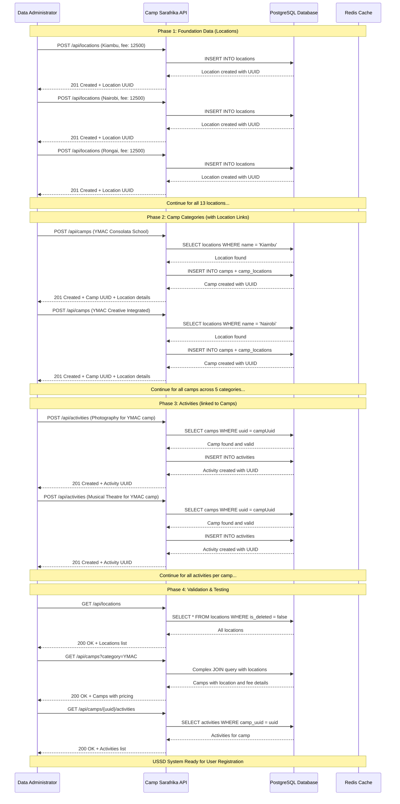

# API Reference

## Overview

The Camp Sarafrika API provides RESTful endpoints for managing all aspects of the camp registration system. All data population and management should be done through these APIs rather than direct database manipulation.

## Base URL

```
http://localhost:8080
```

## Authentication

Currently, the API does not require authentication. In production, consider implementing:
- API key authentication
- JWT tokens
- Role-based access control

## Content Type

All requests should use `application/json` content type:
```
Content-Type: application/json
```

## Response Format

All API responses follow a consistent format:

**Success Response:**
```json
HTTP 200/201
{
  "data": {...},
  "status": "success"
}
```

**Error Response:**
```json
HTTP 4xx/5xx
{
  "error": "Error description",
  "status": "error"
}
```

## Location Management API

### Get All Locations

**Endpoint:** `GET /api/locations`

**Description:** Retrieve all active locations with their fees.

**Response:**
```json
[
  {
    "uuid": "123e4567-e89b-12d3-a456-426614174000",
    "name": "Kiambu",
    "fee": 12500.00,
    "createdDate": "2024-09-10T10:30:00Z",
    "createdBy": "api"
  }
]
```

### Get Location by UUID

**Endpoint:** `GET /api/locations/{uuid}`

**Parameters:**
- `uuid` (path): Location UUID

**Response:**
```json
{
  "uuid": "123e4567-e89b-12d3-a456-426614174000",
  "name": "Kiambu",
  "fee": 12500.00,
  "createdDate": "2024-09-10T10:30:00Z",
  "createdBy": "api"
}
```

### Create Location

**Endpoint:** `POST /api/locations`

**Request Body:**
```json
{
  "name": "Kiambu",
  "fee": 12500.00
}
```

**Response:**
```json
HTTP 201
{
  "uuid": "123e4567-e89b-12d3-a456-426614174000",
  "name": "Kiambu",
  "fee": 12500.00,
  "createdDate": "2024-09-10T10:30:00Z",
  "createdBy": "api"
}
```

**Validation Rules:**
- `name`: Required, non-empty string
- `fee`: Required, positive decimal number

### Update Location

**Endpoint:** `PUT /api/locations/{uuid}`

**Parameters:**
- `uuid` (path): Location UUID

**Request Body:**
```json
{
  "name": "Updated Kiambu",
  "fee": 13000.00
}
```

**Response:**
```json
{
  "uuid": "123e4567-e89b-12d3-a456-426614174000",
  "name": "Updated Kiambu",
  "fee": 13000.00,
  "updatedDate": "2024-09-10T11:30:00Z",
  "updatedBy": "api"
}
```

### Delete Location

**Endpoint:** `DELETE /api/locations/{uuid}`

**Parameters:**
- `uuid` (path): Location UUID

**Response:**
```json
HTTP 204 No Content
```

## Camp Management API

### Get All Camps

**Endpoint:** `GET /api/camps`

**Query Parameters:**
- `category` (optional): Filter by camp category

**Examples:**
```
GET /api/camps
GET /api/camps?category=Sports
```

**Response:**
```json
[
  {
    "uuid": "456e7890-e89b-12d3-a456-426614174000",
    "name": "YMAC Consolata School",
    "category": "Young Musicians & Artists Camp (YMAC)",
    "campType": "HALF_DAY",
    "dates": "17th-29th Nov",
    "locations": [
      {
        "uuid": "123e4567-e89b-12d3-a456-426614174000",
        "name": "Kiambu",
        "fee": 12500.00
      }
    ]
  }
]
```

### Get Camp by UUID

**Endpoint:** `GET /api/camps/{uuid}`

**Parameters:**
- `uuid` (path): Camp UUID

**Response:**
```json
{
  "uuid": "456e7890-e89b-12d3-a456-426614174000",
  "name": "YMAC Consolata School",
  "category": "Young Musicians & Artists Camp (YMAC)",
  "campType": "HALF_DAY",
  "dates": "17th-29th Nov",
  "locations": [
    {
      "uuid": "123e4567-e89b-12d3-a456-426614174000",
      "name": "Kiambu",
      "fee": 12500.00
    }
  ],
  "activities": [
    {
      "uuid": "789e1234-e89b-12d3-a456-426614174000",
      "name": "Photography",
      "category": "Visual Arts"
    }
  ]
}
```

### Create Camp

**Endpoint:** `POST /api/camps`

**Request Body:**
```json
{
  "name": "YMAC Consolata School",
  "category": "Young Musicians & Artists Camp (YMAC)",
  "campType": "HALF_DAY",
  "dates": "17th-29th Nov",
  "locations": [
    {
      "name": "Kiambu"
    }
  ]
}
```

**Response:**
```json
HTTP 201
{
  "uuid": "456e7890-e89b-12d3-a456-426614174000",
  "name": "YMAC Consolata School",
  "category": "Young Musicians & Artists Camp (YMAC)",
  "campType": "HALF_DAY",
  "dates": "17th-29th Nov",
  "locations": [
    {
      "uuid": "123e4567-e89b-12d3-a456-426614174000",
      "name": "Kiambu",
      "fee": 12500.00
    }
  ]
}
```

**Validation Rules:**
- `name`: Required, non-empty string
- `category`: Required, valid category from enum
- `campType`: Required, either "HALF_DAY" or "BOOT_CAMP"
- `dates`: Required, string representing camp dates
- `locations`: Required, array of location references

### Update Camp

**Endpoint:** `PUT /api/camps/{uuid}`

**Parameters:**
- `uuid` (path): Camp UUID

**Request Body:**
```json
{
  "name": "Updated YMAC Consolata School",
  "category": "Young Musicians & Artists Camp (YMAC)",
  "campType": "HALF_DAY",
  "dates": "17th-30th Nov"
}
```

### Delete Camp

**Endpoint:** `DELETE /api/camps/{uuid}`

**Parameters:**
- `uuid` (path): Camp UUID

**Response:**
```json
HTTP 204 No Content
```

### Get Camp Categories

**Endpoint:** `GET /api/camps/categories`

**Description:** Get all distinct camp categories.

**Response:**
```json
[
  "Sports",
  "Young Musicians & Artists Camp (YMAC)",
  "Science & Tech",
  "Culture & Heritage",
  "Outdoor & Adventure"
]
```

### Get Camp Activities

**Endpoint:** `GET /api/camps/{uuid}/activities`

**Parameters:**
- `uuid` (path): Camp UUID

**Response:**
```json
[
  {
    "uuid": "789e1234-e89b-12d3-a456-426614174000",
    "name": "Photography",
    "description": "Learn artistic photography techniques",
    "category": "Visual Arts",
    "isAvailable": true
  }
]
```

## Activity Management API

### Get All Activities

**Endpoint:** `GET /api/activities`

**Query Parameters:**
- `category` (optional): Filter by activity category
- `campUuid` (optional): Filter by camp UUID

**Examples:**
```
GET /api/activities
GET /api/activities?category=Music
GET /api/activities?campUuid=456e7890-e89b-12d3-a456-426614174000
```

**Response:**
```json
[
  {
    "uuid": "789e1234-e89b-12d3-a456-426614174000",
    "name": "Photography",
    "description": "Learn artistic photography techniques",
    "category": "Visual Arts",
    "campUuid": "456e7890-e89b-12d3-a456-426614174000",
    "isAvailable": true
  }
]
```

### Get Activity by UUID

**Endpoint:** `GET /api/activities/{uuid}`

**Parameters:**
- `uuid` (path): Activity UUID

**Response:**
```json
{
  "uuid": "789e1234-e89b-12d3-a456-426614174000",
  "name": "Photography",
  "description": "Learn artistic photography techniques",
  "category": "Visual Arts",
  "campUuid": "456e7890-e89b-12d3-a456-426614174000",
  "isAvailable": true
}
```

### Create Activity

**Endpoint:** `POST /api/activities`

**Request Body:**
```json
{
  "name": "Photography",
  "description": "Learn artistic photography techniques",
  "category": "Visual Arts",
  "campUuid": "456e7890-e89b-12d3-a456-426614174000",
  "isAvailable": true
}
```

**Response:**
```json
HTTP 201
{
  "uuid": "789e1234-e89b-12d3-a456-426614174000",
  "name": "Photography",
  "description": "Learn artistic photography techniques",
  "category": "Visual Arts",
  "campUuid": "456e7890-e89b-12d3-a456-426614174000",
  "isAvailable": true
}
```

**Validation Rules:**
- `name`: Required, non-empty string
- `campUuid`: Required, valid UUID of existing camp
- `description`: Optional, string
- `category`: Optional, string
- `isAvailable`: Optional, boolean (defaults to true)

### Update Activity

**Endpoint:** `PUT /api/activities/{uuid}`

**Parameters:**
- `uuid` (path): Activity UUID

**Request Body:**
```json
{
  "name": "Advanced Photography",
  "description": "Advanced artistic photography techniques",
  "category": "Visual Arts",
  "isAvailable": true
}
```

### Delete Activity

**Endpoint:** `DELETE /api/activities/{uuid}`

**Parameters:**
- `uuid` (path): Activity UUID

**Response:**
```json
HTTP 204 No Content
```

### Get Activity Categories

**Endpoint:** `GET /api/activities/categories`

**Description:** Get all distinct activity categories.

**Response:**
```json
[
  "Visual Arts",
  "Music",
  "Dance",
  "Performance",
  "Technology"
]
```

## Data Population Workflow

### API Population Sequence Diagram



### Detailed Population Sequence

#### Phase 1: Foundation Data (Locations)

**Step 1-13: Create all locations with their fees**

```bash
# Primary locations from PDF specification
curl -X POST http://localhost:8080/api/locations \
  -H "Content-Type: application/json" \
  -d '{"name": "Kiambu", "fee": 12500.00}'

curl -X POST http://localhost:8080/api/locations \
  -H "Content-Type: application/json" \
  -d '{"name": "Nairobi", "fee": 12500.00}'

curl -X POST http://localhost:8080/api/locations \
  -H "Content-Type: application/json" \
  -d '{"name": "Rongai", "fee": 12500.00}'

# Additional locations with varied pricing
curl -X POST http://localhost:8080/api/locations \
  -H "Content-Type: application/json" \
  -d '{"name": "Naivasha", "fee": 15000.00}'

curl -X POST http://localhost:8080/api/locations \
  -H "Content-Type: application/json" \
  -d '{"name": "Karen", "fee": 12000.00}'

curl -X POST http://localhost:8080/api/locations \
  -H "Content-Type: application/json" \
  -d '{"name": "Mombasa", "fee": 18000.00}'

curl -X POST http://localhost:8080/api/locations \
  -H "Content-Type: application/json" \
  -d '{"name": "Mount Kenya", "fee": 22000.00}'

curl -X POST http://localhost:8080/api/locations \
  -H "Content-Type: application/json" \
  -d '{"name": "Kisumu", "fee": 14000.00}'

# Specialized locations
curl -X POST http://localhost:8080/api/locations \
  -H "Content-Type: application/json" \
  -d '{"name": "Nairobi Sports Club", "fee": 15000.00}'

curl -X POST http://localhost:8080/api/locations \
  -H "Content-Type: application/json" \
  -d '{"name": "University of Nairobi", "fee": 18000.00}'

curl -X POST http://localhost:8080/api/locations \
  -H "Content-Type: application/json" \
  -d '{"name": "National Museums", "fee": 13000.00}'

curl -X POST http://localhost:8080/api/locations \
  -H "Content-Type: application/json" \
  -d '{"name": "Aberdare National Park", "fee": 25000.00}'

curl -X POST http://localhost:8080/api/locations \
  -H "Content-Type: application/json" \
  -d '{"name": "iHub Nairobi", "fee": 22000.00}'
```

**Expected Response for each location:**
```json
{
  "uuid": "123e4567-e89b-12d3-a456-426614174000",
  "name": "Kiambu",
  "fee": 12500.00,
  "createdDate": "2024-09-10T10:30:00Z",
  "createdBy": "api"
}
```

#### Phase 2: Camp Categories (22 camps total)

**YMAC Camps (7 camps):**
```bash
# Save the returned UUIDs from each call for use in activities
curl -X POST http://localhost:8080/api/camps \
  -H "Content-Type: application/json" \
  -d '{
    "name": "YMAC Consolata School",
    "category": "Young Musicians & Artists Camp (YMAC)",
    "campType": "HALF_DAY",
    "dates": "17th-29th Nov",
    "locations": [{"name": "Kiambu"}]
  }'

curl -X POST http://localhost:8080/api/camps \
  -H "Content-Type: application/json" \
  -d '{
    "name": "YMAC Creative Integrated School",
    "category": "Young Musicians & Artists Camp (YMAC)",
    "campType": "HALF_DAY",
    "dates": "3rd-20th Nov",
    "locations": [{"name": "Nairobi"}]
  }'

# Continue for all 7 YMAC camps...
```

**Sports Camps (5 camps):**
```bash
curl -X POST http://localhost:8080/api/camps \
  -H "Content-Type: application/json" \
  -d '{
    "name": "Sports Excellence Academy",
    "category": "Sports",
    "campType": "HALF_DAY",
    "dates": "Dec 5-15",
    "locations": [{"name": "Nairobi Sports Club"}]
  }'

# Continue for all 5 Sports camps...
```

**Science & Tech Camps (5 camps):**
```bash
curl -X POST http://localhost:8080/api/camps \
  -H "Content-Type: application/json" \
  -d '{
    "name": "Coding Bootcamp",
    "category": "Science & Tech",
    "campType": "BOOT_CAMP",
    "dates": "Jan 15-25",
    "locations": [{"name": "iHub Nairobi"}]
  }'

# Continue for all 5 Science & Tech camps...
```

**Culture & Heritage Camps (4 camps):**
```bash
curl -X POST http://localhost:8080/api/camps \
  -H "Content-Type: application/json" \
  -d '{
    "name": "Cultural Heritage Experience",
    "category": "Culture & Heritage",
    "campType": "HALF_DAY",
    "dates": "Dec 12-22",
    "locations": [{"name": "National Museums"}]
  }'

# Continue for all 4 Culture & Heritage camps...
```

**Outdoor & Adventure Camps (4 camps):**
```bash
curl -X POST http://localhost:8080/api/camps \
  -H "Content-Type: application/json" \
  -d '{
    "name": "Mount Kenya Expedition",
    "category": "Outdoor & Adventure",
    "campType": "BOOT_CAMP",
    "dates": "Jan 5-15",
    "locations": [{"name": "Mount Kenya"}]
  }'

# Continue for all 4 Outdoor & Adventure camps...
```

#### Phase 3: Activities (18 activities per YMAC camp, 6 per other camps)

**For each YMAC camp, add all 18 activities from PDF:**
```bash
# Use the camp UUID returned from camp creation
YMAC_CAMP_UUID="456e7890-e89b-12d3-a456-426614174000"

curl -X POST http://localhost:8080/api/activities \
  -H "Content-Type: application/json" \
  -d '{
    "name": "Know your Talent Beginners Program",
    "description": "Foundation program for discovering artistic talents",
    "category": "Foundation",
    "campUuid": "'$YMAC_CAMP_UUID'",
    "isAvailable": true
  }'

curl -X POST http://localhost:8080/api/activities \
  -H "Content-Type: application/json" \
  -d '{
    "name": "Photography",
    "description": "Learn artistic photography techniques and composition",
    "category": "Visual Arts",
    "campUuid": "'$YMAC_CAMP_UUID'",
    "isAvailable": true
  }'

curl -X POST http://localhost:8080/api/activities \
  -H "Content-Type: application/json" \
  -d '{
    "name": "Musical Theatre",
    "description": "Combine acting, singing, and dancing in theatrical productions",
    "category": "Performance",
    "campUuid": "'$YMAC_CAMP_UUID'",
    "isAvailable": true
  }'

# Continue for all 18 YMAC activities...
```

**For Sports camps:**
```bash
SPORTS_CAMP_UUID="789e1234-e89b-12d3-a456-426614174000"

curl -X POST http://localhost:8080/api/activities \
  -H "Content-Type: application/json" \
  -d '{
    "name": "Football",
    "description": "Soccer skills development and team play",
    "category": "Team Sports",
    "campUuid": "'$SPORTS_CAMP_UUID'",
    "isAvailable": true
  }'

# Continue for all 6 Sports activities...
```

#### Phase 4: Validation & Testing

**Verify all data is properly populated:**
```bash
# Check all locations
curl -X GET http://localhost:8080/api/locations

# Check camps by category
curl -X GET http://localhost:8080/api/camps?category=Young%20Musicians%20%26%20Artists%20Camp%20%28YMAC%29

# Check activities for a specific camp
curl -X GET http://localhost:8080/api/camps/{camp-uuid}/activities

# Get all categories
curl -X GET http://localhost:8080/api/camps/categories

# Get all activity categories
curl -X GET http://localhost:8080/api/activities/categories
```

### Population Summary

**Total API Calls Required:**
- **13 Location calls** (Phase 1)
- **22 Camp calls** (Phase 2)  
- **150+ Activity calls** (Phase 3: 7×18 + 15×6)
- **5+ Validation calls** (Phase 4)

**≈ 190 total API calls** to fully populate the system with PDF specification data.

### 1. Create Locations First

Before creating any camps, populate all locations with their respective fees as shown in Phase 1 above.

### 2. Create Camps with Location References

Create camps and link them to existing locations as shown in Phase 2 above.

### 3. Add Activities to Camps

Use the camp UUID from the previous response to create activities as shown in Phase 3 above.

## Error Handling

### Common Error Codes

- **400 Bad Request**: Invalid input data, validation errors
- **404 Not Found**: Resource not found
- **500 Internal Server Error**: Server-side errors

### Error Response Examples

**Validation Error:**
```json
HTTP 400
{
  "error": "Location name is required"
}
```

**Not Found Error:**
```json
HTTP 404
{
  "error": "Location not found"
}
```

**UUID Format Error:**
```json
HTTP 400
{
  "error": "Invalid UUID format"
}
```

## Rate Limiting

Currently no rate limiting is implemented. For production deployment, consider:
- Request rate limits per IP
- API key-based quotas
- Concurrent request limits

## OpenAPI Documentation

The API includes built-in OpenAPI documentation available at:
```
GET /q/swagger-ui
```

This provides an interactive interface for testing all endpoints.

## Data Management Best Practices

### 1. Always Use UUIDs
- Never use internal database IDs in API calls
- Always reference entities by their UUID

### 2. Validate Relationships
- Ensure locations exist before creating camps
- Ensure camps exist before creating activities

### 3. Handle Soft Deletes
- Deleted entities return 404 but remain in database
- Use appropriate flags to filter deleted entities

### 4. Maintain Data Integrity
- Use transactions for related operations
- Validate all foreign key relationships

### 5. Monitor API Usage
- Log all API calls for audit trails
- Monitor performance and errors
- Track data population progress

---

**Next**: [Data Flow Diagrams](./06-DATA_FLOW.md)