# Data Flow Diagrams

## Overview

This document provides comprehensive data flow diagrams showing how information moves through the Camp Sarafrika USSD system, from user interaction to data persistence and external service integration.

## High-Level System Data Flow

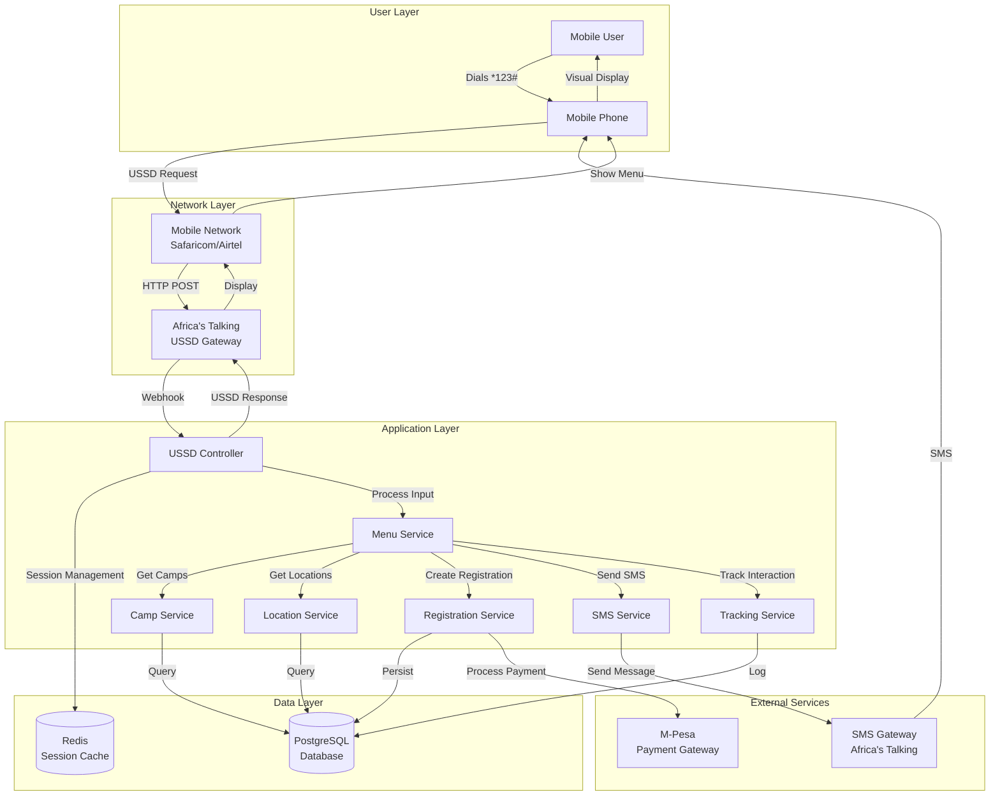

## USSD Request-Response Flow

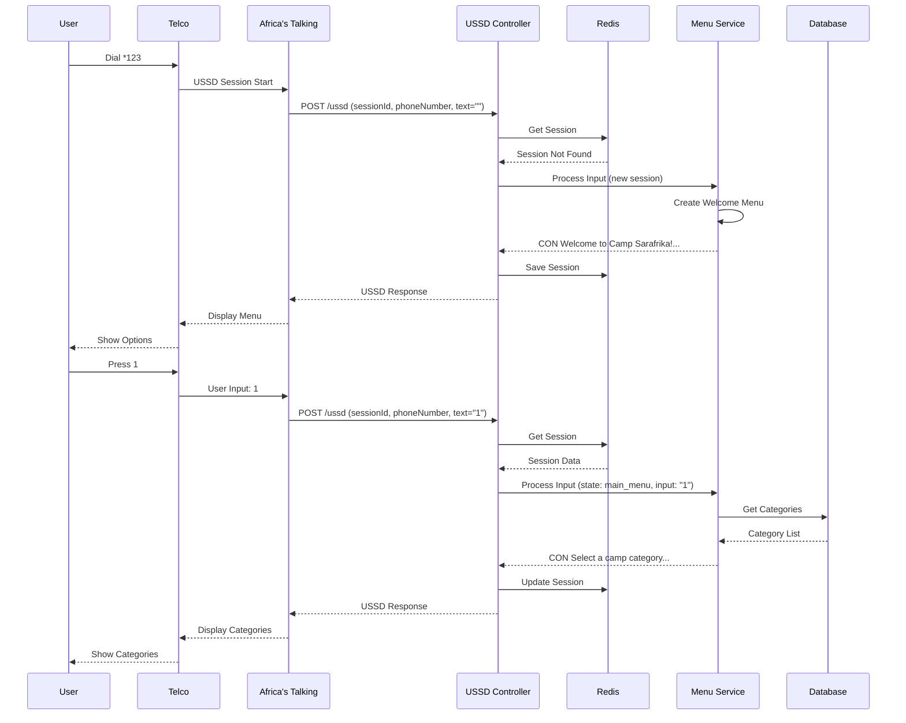

## Registration Data Flow

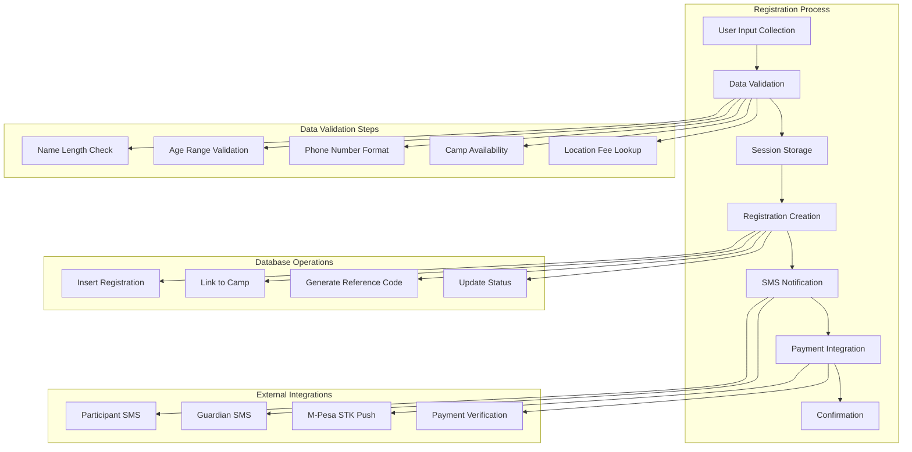

## Session Management Flow

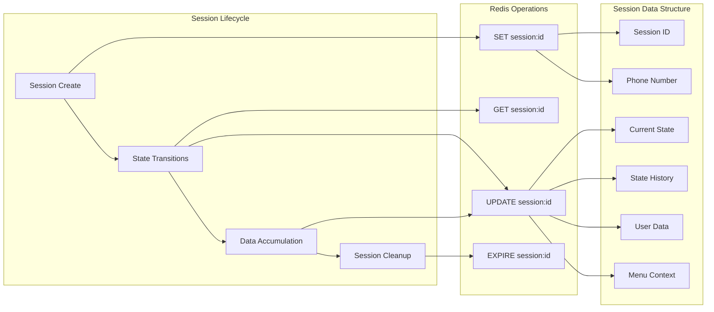

## Database Query Flow

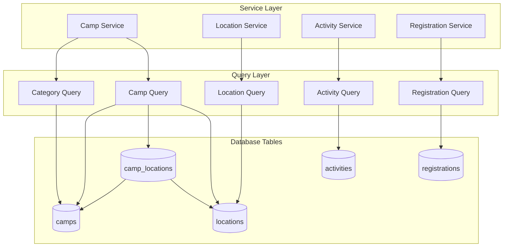

## SMS Notification Flow

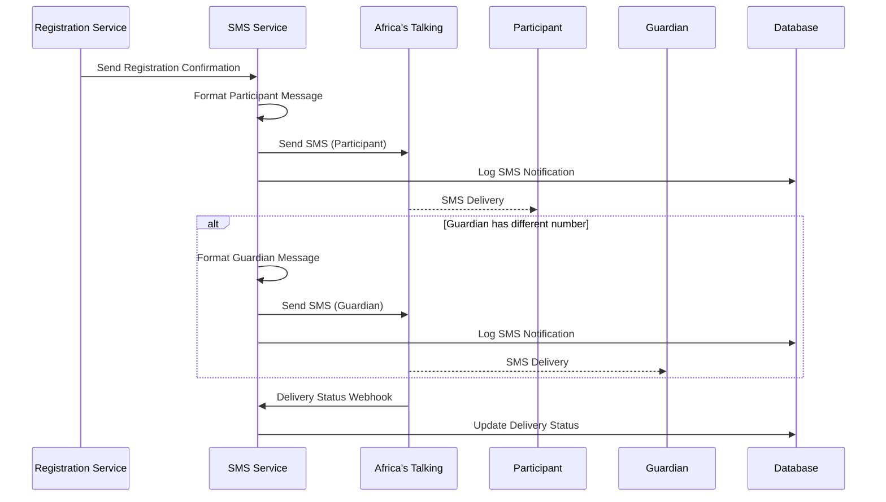

## Payment Integration Flow

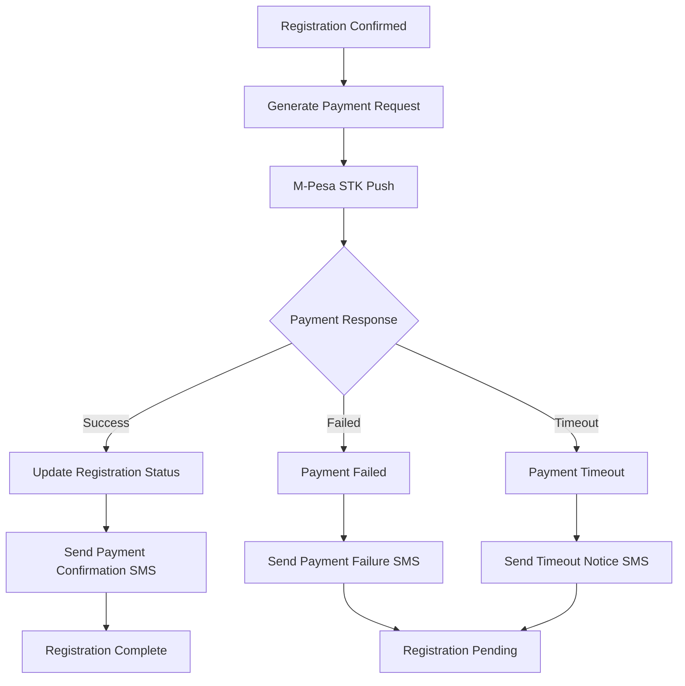

## Error Handling Flow

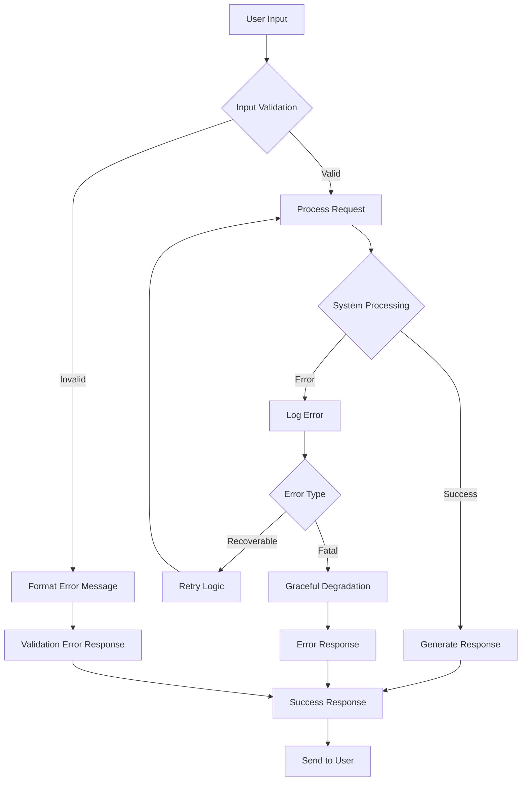

## Analytics and Tracking Flow

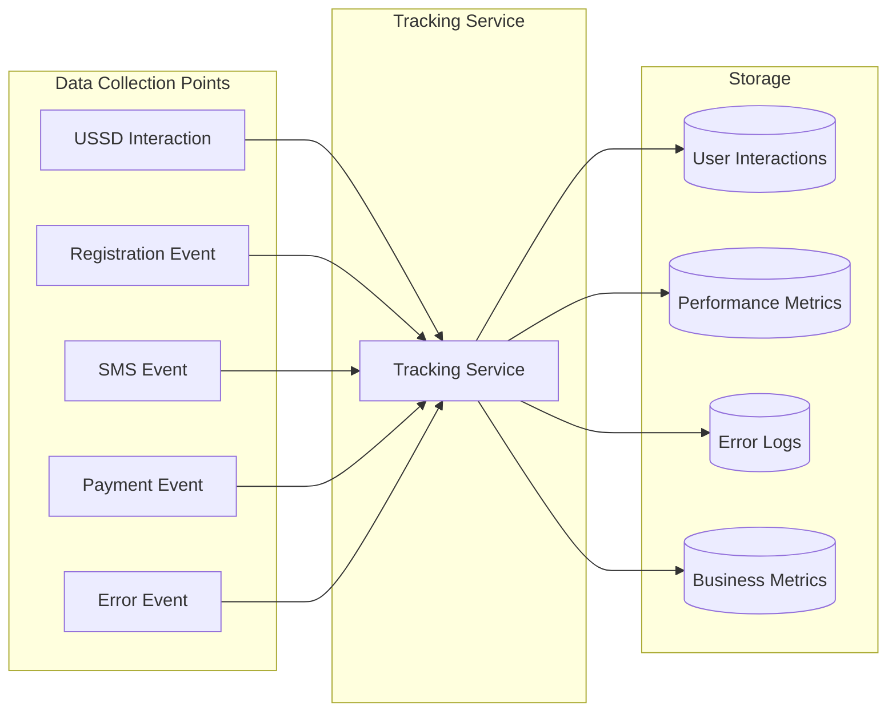

## Cache Strategy Flow

```mermaid
graph TD
    A[Request Comes In] --> B{Check Redis Cache}
    B -->|Hit| C[Return Cached Data]
    B -->|Miss| D[Query Database]
    
    D --> E[Process Results]
    E --> F[Cache Results in Redis]
    F --> G[Return Data]
    
    C --> H[Update Last Access]
    G --> I[Set TTL]
    
    subgraph "Cache Keys"
        K1[session:{sessionId}]
        K2[camps:{category}]
        K3[locations:all]
        K4[activities:{campId}]
    end
    
    subgraph "TTL Settings"
        T1[Sessions: 5 minutes]
        T2[Static Data: 1 hour]
        T3[Dynamic Data: 15 minutes]
    end
```

## Backup and Recovery Flow

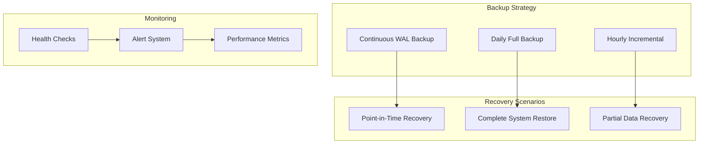

## Monitoring and Observability Flow

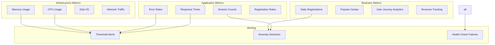

---

**Next**: [API Reference](./05-API_REFERENCE.md)